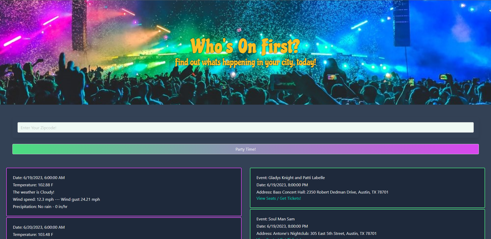

# Who's on First

## Why do we do this
Projects are important in the mission to becoming a web developer, as opportunities to apply for web developer roles. One of the requirements is high-quality deployed examples of your work to feature in your portfolio. This shows employers what you can do and the role you play when working on projects

## What's it for

This project, as an example of our skills and knowledge, showcases CSS framework, and interactiveness, using two server-side APIs (weather and event). The creators made an event tracker that allows weather to be observed while viewing, with JavaScript functional and object-oriented programming often used due to its efficiency as you will see viewing the code and the deployed project.

## Application Description
This site serves as a way to view upcoming live events in your local area as well as the weather forecast for the week. The application uses the SeatGeek API and the tomorrow.io API to pull local events and weather respectively. 

## Usage
Input the zipcode of the area you would like to check and the application will pull event and weather data and populate the screen with cards containing that information.

## Sneak Peek

## Credits
Collaborators:
Andrew Comuzzie - https://github.com/AComuzzie
Traivon Terry - https://github.com/iamtrai
Danfeng Wang - https://github.com/Danfeng-Danny-Wang
Jordan Roberts - https://github.com/CosmoXLav

APIs:
SeatGeek - https://platform.seatgeek.com/
Tomorrow.io - https://www.tomorrow.io/

CSS Frameworks:
Photography Aditya Chinchure, via Unsplash.com
Bulma - https://bulma.io/
Tailwind - https://tailwindcss.com/

Photo Credit: 
Photography Aditya Chinchure, via Unsplash.com

Deployed Link: https://acomuzzie.github.io/the-vibe/
Github Link: https://github.com/AComuzzie/whos-on-first
